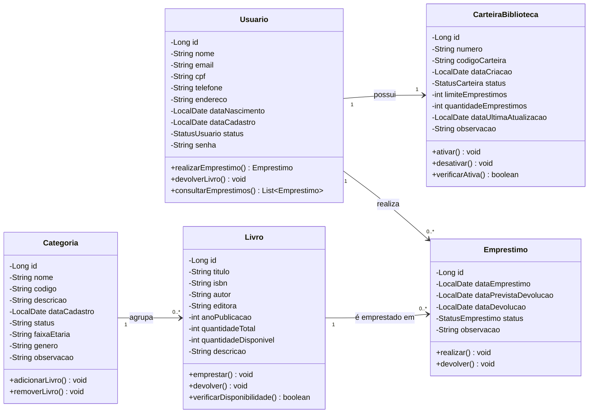
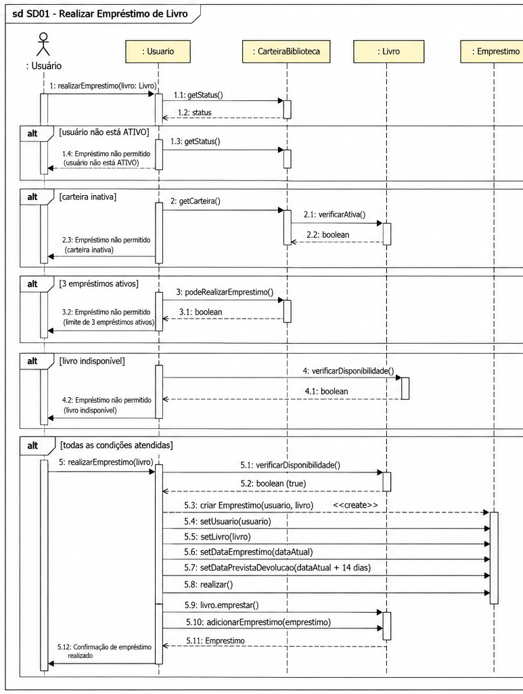
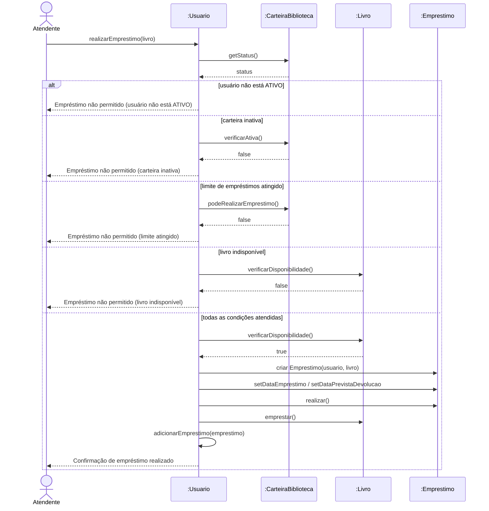
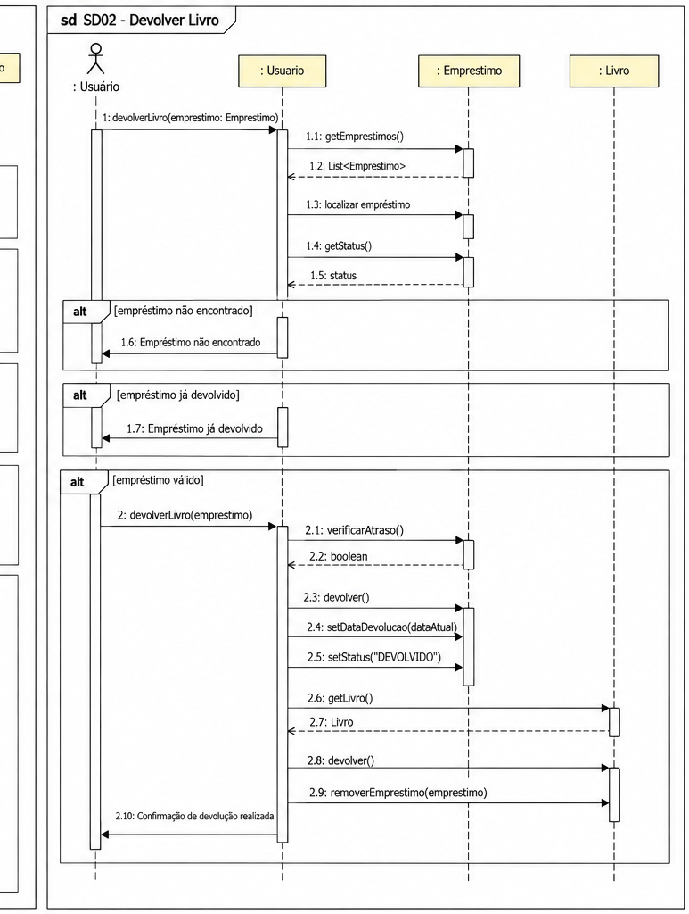
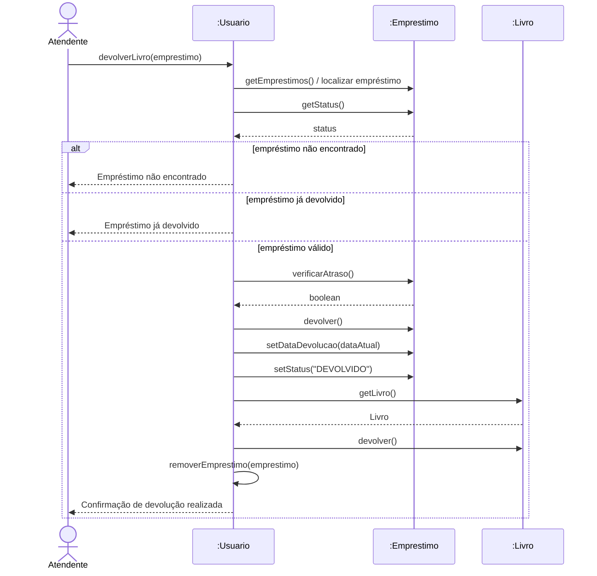

# Sistema de Gerenciamento de Biblioteca

Projeto acadêmico de um sistema desktop para controlar o acervo, os usuários e o **empréstimo e a devolução de livros** de uma biblioteca.

**Curso:** Padrões de Projeto  
**Tecnologias:** Java · MySQL · NetBeans

---

## Sumário

- [Sobre o projeto](#sobre-o-projeto)
- [Objetivos](#objetivos)
- [Funcionalidades](#funcionalidades)
- [Regras de negócio](#regras-de-negócio)
- [Tecnologias utilizadas](#tecnologias-utilizadas)
- [Organização do código](#organização-do-código)
- [Modelagem (UML)](#modelagem-uml)
- [Interfaces do sistema](#interfaces-do-sistema)
- [Banco de dados](#banco-de-dados)
- [Como executar](#como-executar)
- [Nomes](#nomes)

---

## Sobre o projeto

Este trabalho foi desenvolvido para aplicar, em um sistema completo, os conceitos de **orientação a objetos**, **modelagem UML**, **banco de dados relacional** e **desenvolvimento em camadas**. O tema escolhido foi uma biblioteca, na qual é preciso cadastrar usuários e livros e controlar quem está com cada exemplar, respeitando as regras de empréstimo.

O sistema foi construído a partir de uma modelagem prévia, com **diagrama de classes** e **diagramas de sequência** para os casos de uso principais (realizar empréstimo e devolver livro).

## Objetivos

**Objetivo geral:** desenvolver um sistema de gerenciamento de biblioteca que automatize o controle de empréstimos e devoluções de livros.

**Objetivos específicos:**

- Cadastrar usuários, carteiras, categorias e livros.
- Registrar empréstimos e devoluções seguindo as regras da biblioteca.
- Manter o estoque de exemplares sempre atualizado.
- Identificar empréstimos em atraso e bloquear usuários com pendências.
- Permitir a consulta do histórico de empréstimos.

## Funcionalidades

| Módulo | Descrição |
|---|---|
| **Usuários** | Cadastro com nome, e-mail, CPF, telefone, endereço, data de nascimento, senha e status (`ATIVO`, `INATIVO`, `BLOQUEADO`) |
| **Carteiras** | Carteira da biblioteca do usuário, com número, código, limite de empréstimos e status (`ATIVA`, `INATIVA`, `BLOQUEADA`) |
| **Categorias** | Organização do acervo por nome, código, faixa etária e gênero |
| **Livros** | Cadastro com título, ISBN, autor, editora, ano, quantidade de exemplares e categoria |
| **Empréstimo** | Empresta um livro a um usuário, validando todas as regras |
| **Devolução** | Lista os empréstimos pendentes e registra a devolução |
| **Consulta** | Tabela com todos os empréstimos e seus status |

---

## Regras de negócio

As regras abaixo correspondem aos diagramas de sequência **SD01** e **SD02** e estão implementadas no sistema.

### Cadastros

- O **CPF** e o **e-mail** do usuário e o **ISBN** do livro devem ser únicos.
- Nome, e-mail, CPF e senha do usuário são obrigatórios.
- Cada usuário possui **no máximo uma carteira**.
- A carteira é criada com status `ATIVA`, com 0 empréstimos e **limite padrão de 3 empréstimos**.
- Todo livro deve pertencer a uma **categoria**.
- A quantidade disponível de um livro nunca pode ser negativa nem maior que a quantidade total.
- **Nome** e **código** de uma categoria devem ser únicos.

### SD01 — Realizar empréstimo

O empréstimo só é concluído se **todas** as condições forem atendidas:

1. O usuário deve estar **`ATIVO`**.
2. A carteira deve estar **`ATIVA`**.
3. O usuário **não pode ter atingido o limite** de empréstimos ativos (padrão: 3).
4. O livro deve ter **exemplar disponível**.
5. A data prevista de devolução deve ser informada e **não pode estar no passado**.

Sendo aprovado, o sistema cria o empréstimo com status `ATIVO`, **diminui** em 1 a quantidade disponível do livro e **aumenta** em 1 a quantidade de empréstimos da carteira. Tudo isso acontece em uma **única transação**: se algo falhar, nada é gravado (*rollback*).

### SD02 — Devolver livro

1. O empréstimo deve **existir**.
2. O empréstimo **não pode já ter sido devolvido**.
3. Sendo válido, o sistema registra a data de devolução, muda o status para `DEVOLVIDO`, **devolve o exemplar** ao estoque e **libera uma vaga** na carteira do usuário (também em uma única transação).

### Atraso e bloqueio

- Empréstimo não devolvido após a data prevista fica com status **`ATRASADO`**.
- O usuário com empréstimo atrasado passa a **`BLOQUEADO`** e não pode fazer novos empréstimos.
- Quando o usuário devolve os livros atrasados, ele é **desbloqueado automaticamente** e volta a `ATIVO`. Usuários `INATIVO` não são alterados.
- Essa verificação é feita por uma *stored procedure* no MySQL (`atualizar_bloqueios_por_atraso`), executada ao emprestar, devolver e consultar.

### Concorrência

Durante o empréstimo, as linhas do usuário/carteira e do livro são travadas (`SELECT ... FOR UPDATE`), evitando que dois atendimentos simultâneos emprestem o mesmo último exemplar.

---

## Tecnologias utilizadas

| Tecnologia | Uso |
|---|---|
| **Java** | Linguagem de programação (interface em Swing) |
| **MySQL** | Banco de dados |
| **NetBeans** | IDE de desenvolvimento |

---

## Organização do código

O projeto usa **arquitetura em camadas** e aplica os padrões **MVC** (Model-View-Controller) e **DAO** (Data Access Object), que separam a interface, as regras de entrada e o acesso ao banco de dados:

```
SistemaBiblioteca/
├── src/sistemabiblioteca/
│   ├── app/       → Main e classes de teste
│   ├── view/      → Telas (interface gráfica)
│   ├── control/   → Controllers: validações e regras de entrada
│   ├── dao/       → Acesso ao banco de dados (SQL e transações)
│   ├── model/     → Classes do domínio (Usuario, Livro, Emprestimo...)
│   └── util/      → Conexão com o banco
├── docs/          → Diagramas UML
└── nbproject/     → Configuração do NetBeans
```

Fluxo básico: **View → Controller → DAO → MySQL**.

---

## Modelagem (UML)

Os arquivos originais dos diagramas estão na pasta [`docs/`](docs/) (imagens `.png` e o arquivo editável `.drawio`).

### Diagrama de classes



**Relacionamentos:**

- **Usuário → Carteira (1:1):** cada usuário possui uma carteira, que define o limite de empréstimos.
- **Usuário → Empréstimo (1:N):** um usuário pode realizar vários empréstimos.
- **Livro → Empréstimo (1:N):** um livro pode ser emprestado várias vezes ao longo do tempo.
- **Categoria → Livro (1:N):** uma categoria agrupa vários livros.

### SD01 — Realizar empréstimo de livro



<details>
<summary>Versão em Mermaid</summary>



</details>

### SD02 — Devolver livro



<details>
<summary>Versão em Mermaid</summary>



</details>

> Os dois diagramas lado a lado: [`docs/Diagramas_Sequencia_Biblioteca_SD01_SD02__1_.png`](docs/Diagramas_Sequencia_Biblioteca_SD01_SD02__1_.png)

---

## Interfaces do sistema

A interface é feita com janelas simples: formulários com rótulo e campo, listas suspensas carregadas do banco e mensagens de sucesso ou erro em caixas de diálogo.

| Tela | Descrição |
|---|---|
| **Tela principal** | Menu com botões para cadastros, empréstimo, devolução, consulta e sair |
| **Cadastro de usuário** | Nome, e-mail, CPF, telefone, endereço, nascimento e senha |
| **Cadastro de carteira** | Escolha do usuário, número, código e limite de empréstimos |
| **Cadastro de categoria** | Nome, código, descrição, faixa etária, gênero e observação |
| **Cadastro de livro** | Título, ISBN, autor, editora, ano, quantidade, descrição e categoria |
| **Realizar empréstimo** | Escolha do usuário e do livro (apenas disponíveis), data de devolução e observação |
| **Devolução** | Lista de empréstimos pendentes e confirmação da devolução |
| **Consulta de empréstimos** | Tabela com ID, usuário, livro, datas de empréstimo/previsão/devolução e status |

---

## Banco de dados

**Banco:** `biblioteca_db` (MySQL)

| Tabela | Descrição |
|---|---|
| `usuario` | Dados pessoais, senha e status do usuário |
| `carteira_biblioteca` | Carteira do usuário (1:1), com limite e quantidade de empréstimos |
| `categoria` | Categorias do acervo |
| `livro` | Acervo, com quantidade total e quantidade disponível |
| `emprestimo` | Histórico de empréstimos (usuário, livro, datas e status) |

**Procedure:** `atualizar_bloqueios_por_atraso()` — marca empréstimos vencidos como `ATRASADO` e bloqueia os usuários correspondentes.

**View:** `vw_emprestimos_atrasados` — consulta pronta com os empréstimos que estão em atraso.

O script de criação está em [`database/schema.sql`](database/schema.sql).

---

## Como executar

**Pré-requisitos:** JDK 21, NetBeans e um servidor MySQL (MySQL Server ou o MySQL/MariaDB do XAMPP), mais o MySQL Workbench para rodar o script.

1. Baixe o projeto (*Code → Download ZIP*) e extraia, ou clone o repositório, e abra a pasta no **NetBeans** (*File → Open Project*).
2. Inicie o servidor MySQL (no XAMPP, botão *Start* do MySQL).
3. No **MySQL Workbench**, conecte no servidor, abra o arquivo `database/schema.sql` (*File → Open SQL Script*) e execute com o ícone de raio. O script cria o banco `biblioteca_db`, as tabelas, a view e a procedure.
4. Ajuste a conexão em `src/sistemabiblioteca/util/Conexao.java`: porta (`3306` no XAMPP), usuário e senha. No XAMPP padrão o usuário é `root` e a senha é vazia (`""`).
5. O driver **MySQL Connector/J 9.3.0** deve estar em `lib/mysql-connector-j-9.3.0.jar`. Se o NetBeans mostrar o projeto com erro de biblioteca, clique com o botão direito no projeto → *Properties → Libraries → Add JAR/Folder* e selecione esse arquivo.
6. Execute o projeto (tecla `F6`). A classe principal é `sistemabiblioteca.app.Main`.

---

## Nomes

| Nome | RGM |
|---|---|
| Marcelo Augusto Ferreira Silva | 11262200985 |
| Guilherme Matos Andrade da Silva | 11262401464 |
